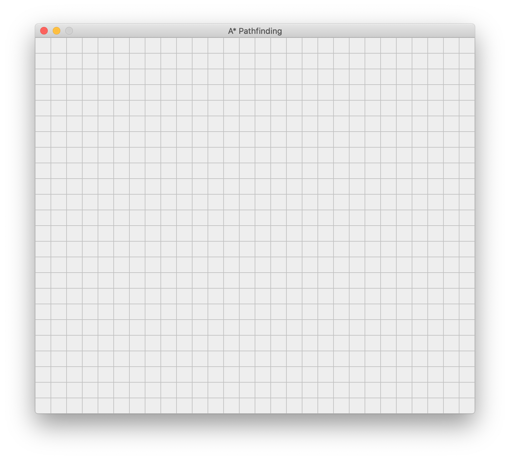
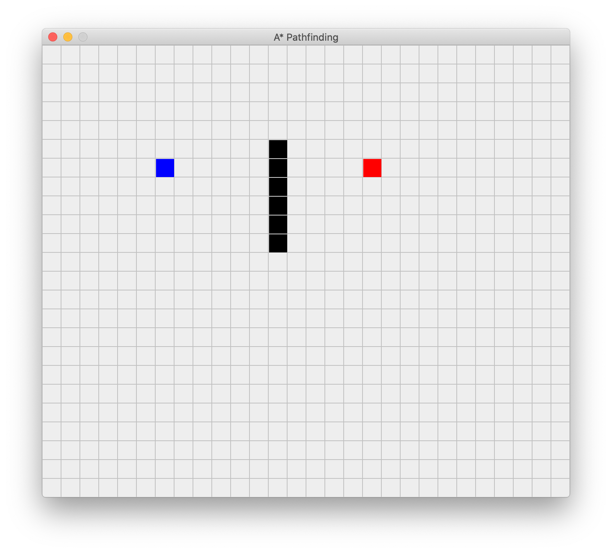
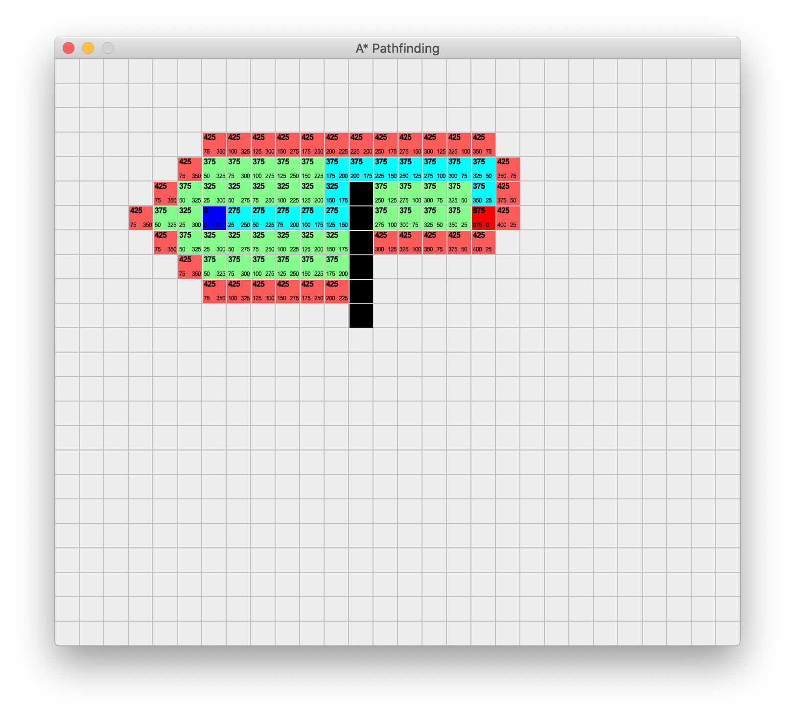
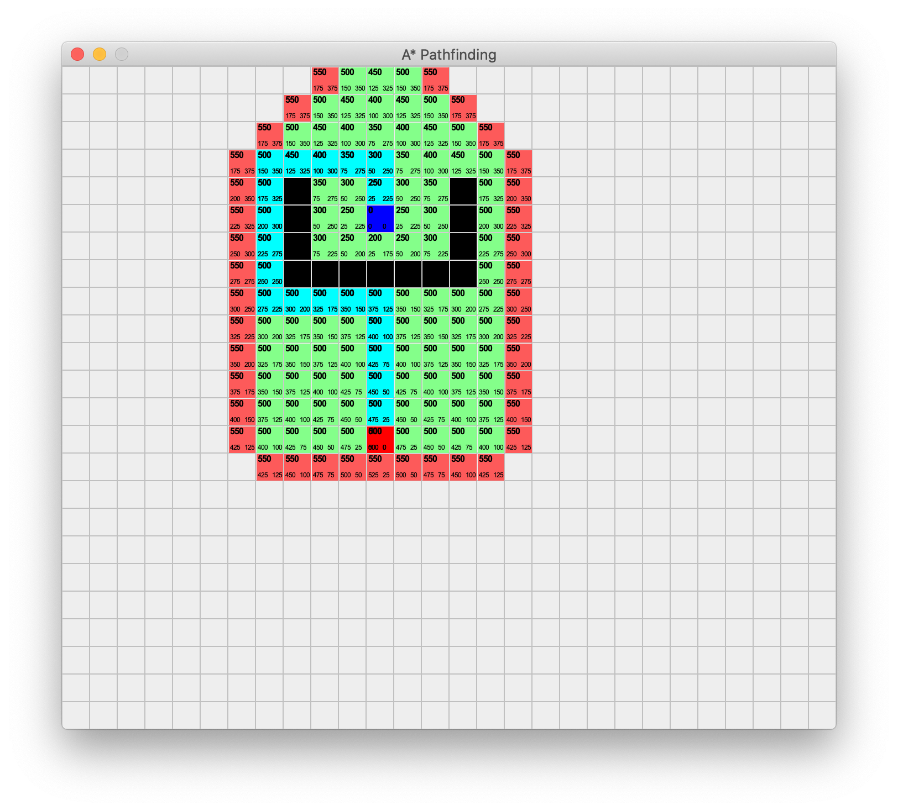
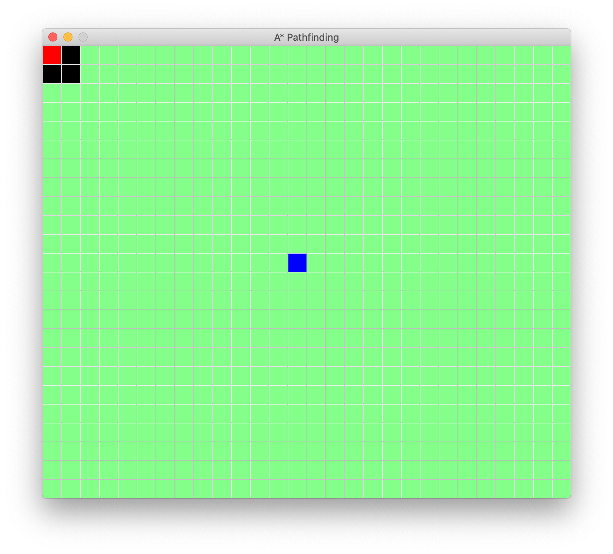

<h1>A* PathFinding Algorithm</h1>

Interactive visual representation of pathfinding algorithm made in Java

<h2>Execute Program</h2>
Compile the Grid.java file and run it with "java Grid"

<h2>Usage</h2>
<ul>
  <li>Left click anywhere to place a border in the grid</li>
  <li>Right Click a border to delete it</li>
  <li>Press s and left click anywhere to place a starting node</li>
  <li>Press e and left click anywhere to place an end node</li>
  <li>Press enter to calculate path</li>
  <li>Press r to clear grid</li>
  <li>Press 1 to generate random borders</li>
  <li>Press 2 to 6 to generate specific cases</li>
</ul>

<h2>Examples of program</h2>

